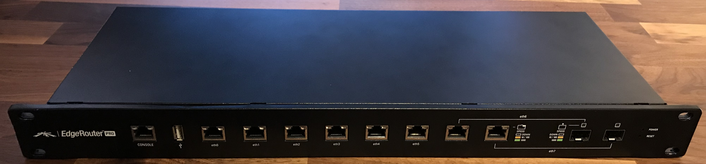
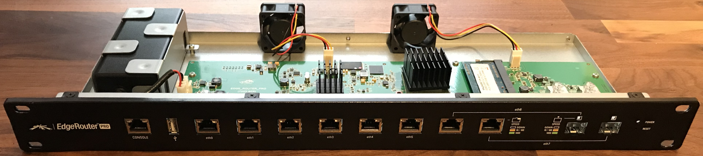
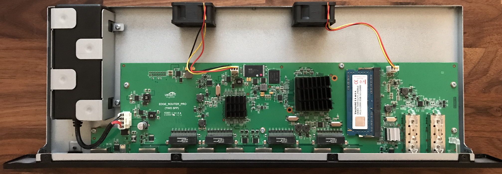
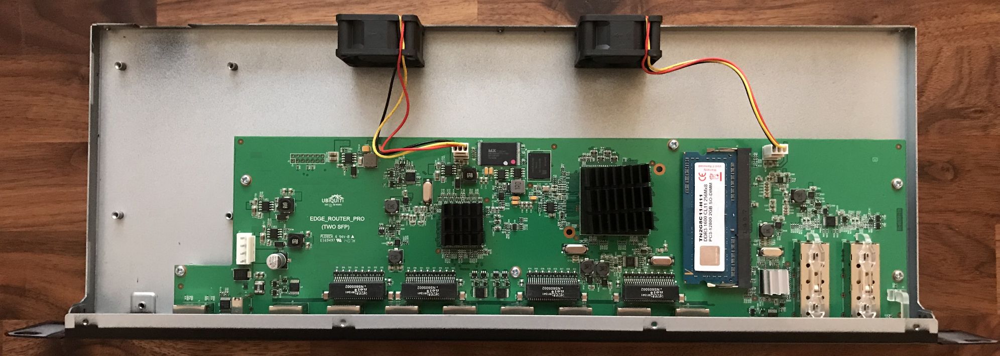
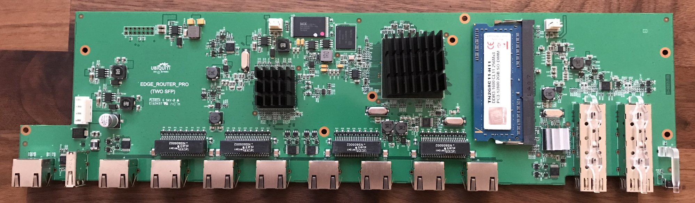
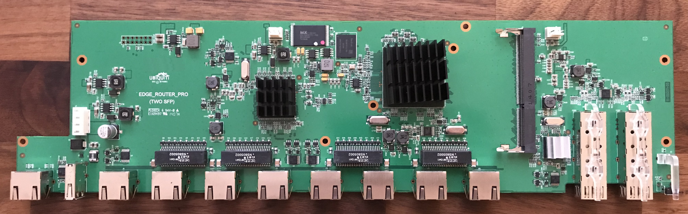
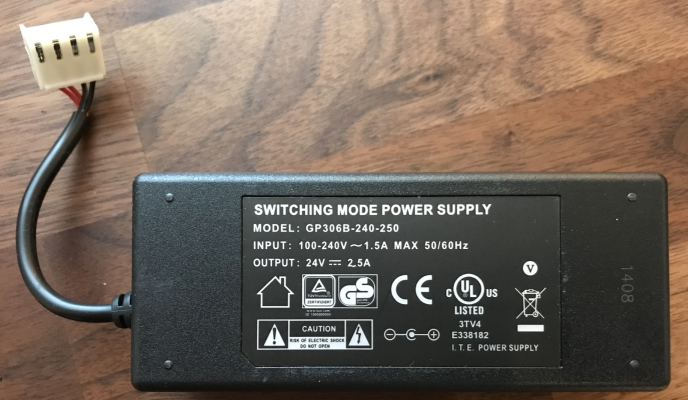
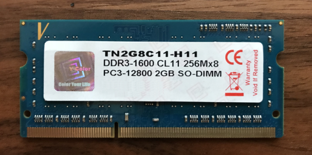

# Ubiquity EdgeRouter PRO (ERPro-8)

## Serial Console

RJ45 serial console port for Command Line Interface (CLI) management. Use an
RJ45-to-DB9, serial console cable, also known as a rollover cable, to connect
the Console port to your computer. (If your computer does not have a DB9 port,
then you will also need a DB9 adapter.) Then configure the following settings as
needed:

* Baud rate: `115200`
* Data bits: `8`
* Parity: `NONE`
* Stop bits: `1`
* Flow control: `NONE`

## U-Boot

```
U-Boot 2012.04.01 (UBNT Build ID: 4605996-gd120a44) (Build time: Oct 14 2013 - 18:14:14)

Skipping PCIe port 0 BIST, in EP mode, can't tell if clocked.
Skipping PCIe port 1 BIST, reset not done. (port not configured)
BIST check passed.
UBNT_E200 r1:0, r2:14, serial #: xxxxxxxxxxxx
Core clock: 1000 MHz, IO clock: 600 MHz, DDR clock: 533 MHz (1066 Mhz DDR)
Base DRAM address used by u-boot: 0x8f800000, size: 0x800000
DRAM: 2 GiB
Clearing DRAM...... done
Flash: 8 MiB
Net:   octeth0, octeth1, octeth2, octeth3, octeth4, octeth5, octeth6, octeth7
MMC:   Octeon MMC/SD0: 0
USB:   USB EHCI 1.00
scanning bus for devices... 1 USB Device(s) found
Type the command 'usb start' to scan for USB storage devices.

Hit any key to stop autoboot:  0
```

### Environment
```
Octeon ubnt_e200# printenv
autoload=n
baudrate=115200
boardname=ubnt_e200
bootcmd=fatload mmc 0 $(loadaddr) vmlinux.64;bootoctlinux $(loadaddr) numcores=2 endbootargs mem=0 root=/dev/mmcblk0p2 rootdelay=10 rw rootsqimg=squashfs.img rootsqwdir=w mtdparts=phys_mapped_flash:640k(boot0),640k(boot1),64k(eeprom)
bootdelay=0
bootloader_flash_update=bootloaderupdate
env_addr=0x1fbfe000
env_size=0x2000
ethact=octeth0
flash_base_addr=0x1f400000
flash_size=0x800000
flash_unused_addr=0x1f530000
flash_unused_size=0x6d0000
loadaddr=0x20000000
mtdparts=phys_mapped_flash:640k(boot0),640k(boot1),64k(eeprom)
nuke_env=protect off $(env_addr) +$(env_size);erase $(env_addr) +$(env_size)
numcores=2
octeon_failsafe_mode=0
octeon_ram_mode=0
serial#=xxxxxxxxxxxx
stderr=serial
stdin=serial
stdout=serial
uboot_flash_addr=0x1f4a0000
uboot_flash_size=0x90000
ver=U-Boot 2012.04.01 (UBNT Build ID: 4605996-gd120a44) (Build time: Oct 14 2013 - 18:14:14)

Environment size: 961/8188 bytes
```

### Intrude into OS

* Skip `init` processd
```bash
U-Boot> setenv bootcmd fatload mmc 0 $(loadaddr) vmlinux.64\;bootoctlinux $(loadaddr) numcores=2 endbootargs mem=0 root=/dev/mmcblk0p2 rootdelay=10 rw rootsqimg=squashfs.img rootsqwdir=w mtdparts=phys_mapped_flash:640k(boot0),640k(boot1),64k(eeprom) init=/bin/sh
U-Boot> run bootcmd
```

* Single user mode
```bash
U-Boot> setenv bootcmd fatload mmc 0 $(loadaddr) vmlinux.64\;bootoctlinux $(loadaddr) numcores=2 endbootargs mem=0 root=/dev/mmcblk0p2 rootdelay=10 rw rootsqimg=squashfs.img rootsqwdir=w mtdparts=phys_mapped_flash:640k(boot0),640k(boot1),64k(eeprom) single
U-Boot> run bootcmd
```

## Linux Kernel
```
reading vmlinux.64

6435976 bytes read
argv[2]: numcores=2
argv[3]: endbootargs
Allocating memory for mapped kernel segment, alignment: 0x400000
Allocated memory for ELF segment: addr: 0x400000, size 0x77cd00
## Loading big-endian Linux kernel with entry point: 0x8000000000899490 ...
Bootloader: Done loading app on coremask: 0x3
Starting cores 0x3
Linux version 3.10.20-UBNT (root@ubnt-builder2) (gcc version 4.7.0 (Cavium Inc. Version: SDK_3_1_0_p2 build 34) ) #1 SMP Fri Jul 29 17:07:24 PDT 2016
CVMSEG size: 2 cache lines (256 bytes)
Cavium Inc. SDK-3.1
bootconsole [early0] enabled
CPU revision is: 000d9301 (Cavium Octeon II)
Checking for the multiply/shift bug... no.
Checking for the daddiu bug... no.
Determined physical RAM map:
 memory: 000000000e400000 @ 0000000000c00000 (usable)
 memory: 0000000000c00000 @ 000000000f200000 (usable)
 memory: 000000006f800000 @ 0000000020000000 (usable)
 memory: 00000000005e2000 @ 0000000000400000 (usable)
 memory: 000000000004e000 @ 00000000009e2000 (usable after init)
Wasting 57344 bytes for tracking 1024 unused pages
Using passed Device Tree <8000000000080000>.
software IO TLB [mem 0x02c0a000-0x02c4a000] (0MB) mapped at [8000000002c0a000-8000000002c49fff]
Zone ranges:
  DMA32    [mem 0x00400000-0xefffffff]
  Normal   empty
Movable zone start for each node
Early memory node ranges
  node   0: [mem 0x00400000-0x00a2ffff]
  node   0: [mem 0x00c00000-0x0effffff]
  node   0: [mem 0x0f200000-0x0fdfffff]
  node   0: [mem 0x20000000-0x8f7fffff]
Primary instruction cache 37kB, virtually tagged, 37 way, 8 sets, linesize 128 bytes.
Primary data cache 32kB, 32-way, 8 sets, linesize 128 bytes.
Secondary unified cache 1024kB, 16-way, 512 sets, linesize 128 bytes.
PERCPU: Embedded 10 pages/cpu @8000000002c6f000 s11904 r8192 d20864 u40960
Built 1 zonelists in Zone order, mobility grouping on.  Total pages: 512622
Kernel command line:  root=/dev/mmcblk0p2 rootdelay=10 rw rootsqimg=squashfs.img rootsqwdir=w mtdparts=phys_mapped_flash:640k(boot0),640k(boot1),64k(eeprom) console=ttyS0,115200
PID hash table entries: 4096 (order: 3, 32768 bytes)
Dentry cache hash table entries: 262144 (order: 9, 2097152 bytes)
Inode-cache hash table entries: 131072 (order: 8, 1048576 bytes)
Memory: 2040272k/2078912k available (4759k kernel code, 38640k reserved, 1261k data, 312k init, 0k highmem)
Hierarchical RCU implementation.
        Additional per-CPU info printed with stalls.
NR_IRQS:255
Calibrating delay loop (skipped) preset value.. 2000.00 BogoMIPS (lpj=10000000)
pid_max: default: 32768 minimum: 501
Security Framework initialized
Mount-cache hash table entries: 256
Checking for the daddi bug... no.
SMP: Booting CPU01 (CoreId  1)...
CPU revision is: 000d9301 (Cavium Octeon II)
Brought up 2 CPUs
NET: Registered protocol family 16
PTP Clock: Using sclk reference at 600000000 Hz
bio: create slab <bio-0> at 0
usbcore: registered new interface driver usbfs
usbcore: registered new interface driver hub
usbcore: registered new device driver usb
Switching to clocksource OCTEON_CVMCOUNT
NET: Registered protocol family 2
TCP established hash table entries: 16384 (order: 6, 262144 bytes)
TCP bind hash table entries: 16384 (order: 6, 262144 bytes)
TCP: Hash tables configured (established 16384 bind 16384)
TCP: reno registered
UDP hash table entries: 1024 (order: 3, 32768 bytes)
UDP-Lite hash table entries: 1024 (order: 3, 32768 bytes)
NET: Registered protocol family 1
octeon_pci_console: Console not created.
/proc/octeon_perf: Octeon performance counter interface loaded
HugeTLB registered 2 MB page size, pre-allocated 0 pages
squashfs: version 4.0 (2009/01/31) Phillip Lougher
Registering unionfs 2.5.13 (for 3.10.34)
msgmni has been set to 3984
io scheduler noop registered
io scheduler cfq registered (default)
Serial: 8250/16550 driver, 6 ports, IRQ sharing disabled
1180000000800.serial: ttyS0 at MMIO 0x1180000000800 (irq = 34) is a OCTEON
console [ttyS0] enabled, bootconsole disabled
console [ttyS0] enabled, bootconsole disabled
1180000000c00.serial: ttyS1 at MMIO 0x1180000000c00 (irq = 35) is a OCTEON
loop: module loaded
ehci_hcd: USB 2.0 'Enhanced' Host Controller (EHCI) Driver
octeon-ehci 16f0000000000.ehci: Octeon EHCI
octeon-ehci 16f0000000000.ehci: new USB bus registered, assigned bus number 1
octeon-ehci 16f0000000000.ehci: irq 56, io mem 0x16f0000000000
octeon-ehci 16f0000000000.ehci: USB 2.0 started, EHCI 1.00
hub 1-0:1.0: USB hub found
hub 1-0:1.0: 2 ports detected
ohci_hcd: USB 1.1 'Open' Host Controller (OHCI) Driver
octeon-ohci 16f0000000400.ohci: Octeon OHCI
octeon-ohci 16f0000000400.ohci: new USB bus registered, assigned bus number 2
octeon-ohci 16f0000000400.ohci: irq 56, io mem 0x16f0000000400
hub 2-0:1.0: USB hub found
hub 2-0:1.0: 2 ports detected
i2c-octeon 1180000001000.i2c: version 2.5
i2c-octeon 1180000001200.i2c: version 2.5
octeon_wdt: Initial granularity 5 Sec
TCP: cubic registered
NET: Registered protocol family 17
NET: Registered protocol family 15
Bootbus flash: Setting flash for 8MB flash at 0x1f400000
phys_mapped_flash: Found 1 x16 devices at 0x0 in 8-bit bank. Manufacturer ID 0x0000c2 Chip ID 0x0000c9
Amd/Fujitsu Extended Query Table at 0x0040
  Amd/Fujitsu Extended Query version 1.1.
phys_mapped_flash: Swapping erase regions for top-boot CFI table.
number of CFI chips: 1
3 cmdlinepart partitions found on MTD device phys_mapped_flash
Creating 3 MTD partitions on "phys_mapped_flash":
0x000000000000-0x0000000a0000 : "boot0"
0x0000000a0000-0x000000140000 : "boot1"
mmc0: BKOPS_EN bit is not set
0x000000140000-0x000000150000 : "eeprom"
Waiting 10sec before mounting root device...
mmc0: new high speed DDR MMC card at address 0001
mmcblk0: mmc0:0001 SEM04G 3.68 GiB
mmcblk0boot0: mmc0:0001 SEM04G partition 1 2.00 MiB
mmcblk0boot1: mmc0:0001 SEM04G partition 2 2.00 MiB
mmcblk0rpmb: mmc0:0001 SEM04G partition 3 2.00 MiB
 mmcblk0: p1 p2
 mmcblk0boot1: unknown partition table
 mmcblk0boot0: unknown partition table
kjournald starting.  Commit interval 3 seconds
EXT3-fs (mmcblk0p2): using internal journal
EXT3-fs (mmcblk0p2): recovery complete
EXT3-fs (mmcblk0p2): mounted filesystem with journal data mode
VFS: Mounted root (unionfs filesystem) on device 0:11.
Freeing unused kernel memory: 312K (ffffffffc05e2000 - ffffffffc0630000)
Algorithmics/MIPS FPU Emulator v1.5
INIT: version 2.88 booting
INIT: Entering runlevel: 2
[ ok ] Starting routing daemon: rib nsm ribd.
[ ok ] Starting EdgeOS router: migrate rl-system configure.

Welcome to EdgeOS foo ttyS0

By logging in, accessing, or using the Ubiquiti product, you
acknowledge that you have read and understood the Ubiquiti
License Agreement (available in the Web UI at, by default,
http://192.168.1.1) and agree to be bound by its terms.
```

### Images








